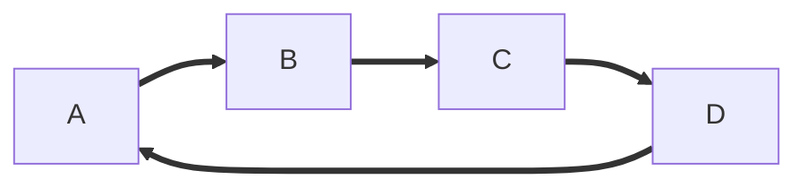

---
tags:
  - 算法
data: 2025-09-06
---

## 适用范围
- 最优子结构
  问题的最优解包含子问题的最优解
- 无后效性
  后续阶段状态的变化不会影响当前阶段的状态
- 重复子问题
  解决问题过程中的⼦问题存在⼤量重叠（冗余计算）
- 不适⽤动态规划的反例：
  最长路径问题：A-C的最长路径经过B，但这条最长路径并不⼀定包含A-B的最长路径

```mermaid
flowchart LR
A ==> B
B ==> C
C ==> D
D ==> A
```